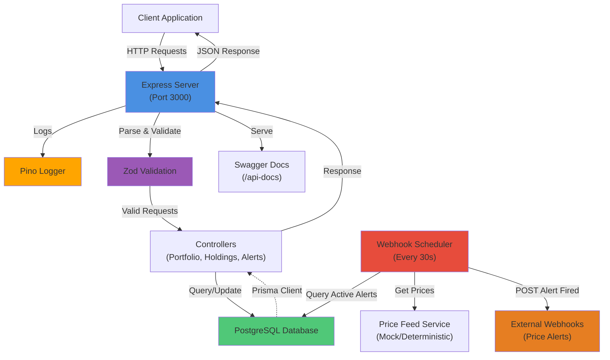

# System Architecture

## Architecture Diagram

## Technology Stack

| Component | Technology | Version |
|-----------|-----------|---------|
| Runtime | Node.js | 24.x |
| Language | TypeScript | 6.0+ |
| Framework | Express | 5.2+ |
| Database | PostgreSQL | 16 |
| ORM | Prisma | 7.8+ |
| Logger | Pino | 10.3+ |
| Validation | Zod | 4.3+ |
| Math | Decimal.js | 10.6+ |
| Scheduler | node-cron | 3.0+ |
| Testing | Vitest | 4.1+ |
| Documentation | Swagger UI | 5.0+ |

## Trade-offs & Architecture Decisions

### Money Handling
- **Choice**: Decimal.js for all calculations
- **Rationale**: Eliminates floating-point errors; all prices in paise
- **Impact**: Deterministic, precise results

### Webhook Scheduling
- **Choice**: node-cron (in-process)
- **Rationale**: Simple, no external dependencies
- **Trade-off**: Single-instance only; scale with queue (BullMQ, etc.)

### Error Responses
- **Choice**: Structured `ApiResponse` with `errorCode` and `details`
- **Rationale**: Consistent client handling
- **Impact**: Verbose but explicit

### Testing Strategy
- **Choice**: Mock Prisma in unit/integration tests
- **Rationale**: Fast, deterministic, CI/CD friendly
- **Trade-off**: Real DB tested with Docker

## Data Flow

1. **Request Phase**:
   - Client sends HTTP request to Express
   - Request logged by Pino middleware
   - Zod validates request body/params

2. **Processing Phase**:
   - Valid request routed to controller
   - Controller queries Prisma ORM
   - Money calculations use Decimal.js

3. **Response Phase**:
   - Controller returns data
   - Response formatted via `http.ts` utility
   - Response sent to client (JSON)

4. **Async: Webhook Scheduler**:
   - Every 30 seconds: check active alerts
   - Get deterministic price for symbol
   - Fire webhook if condition met
   - Mark alert as INACTIVE

## Modules Overview

- **controllers/**: Request handlers for each feature
- **routes/**: Route definitions and HTTP verbs
- **utils/**: Shared utilities (money, http, prices, types)
- **jobs/**: Scheduled tasks (webhook scheduler)
- **config/**: Logger, environment setup
- **constants/**: Centralized messages and constants
- **database/**: Prisma client export
- **docs/**: Swagger/OpenAPI documentation
